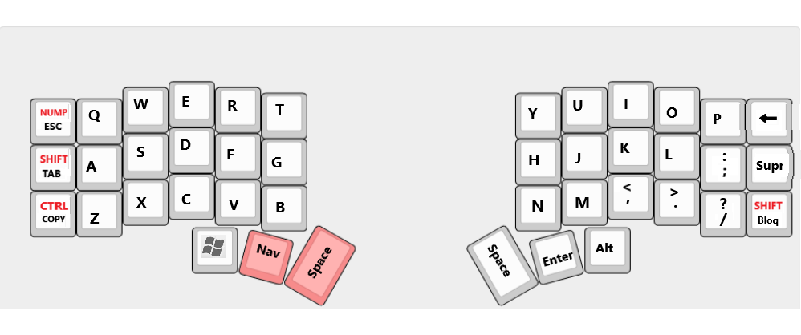
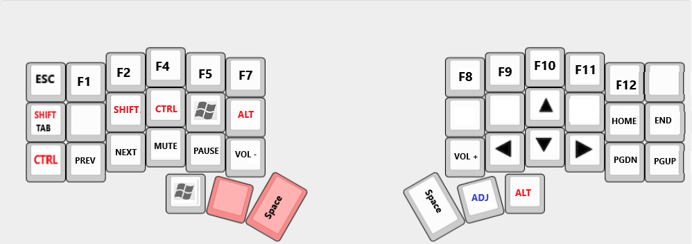
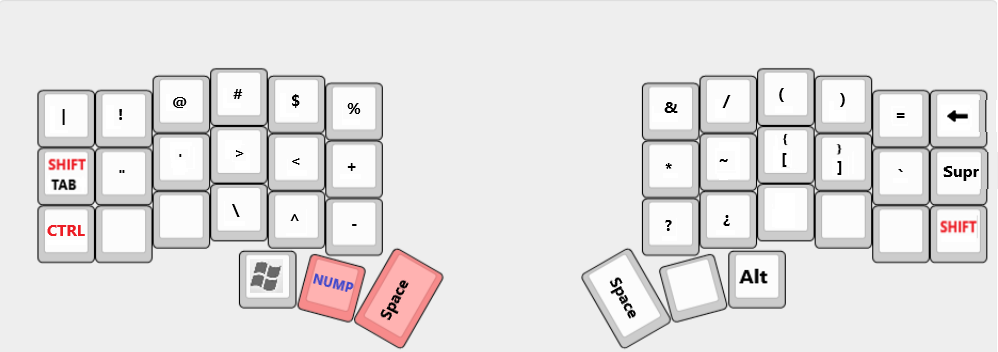
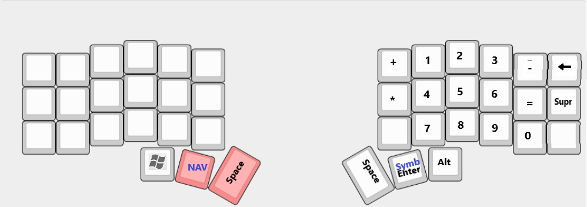
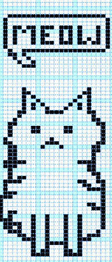

# My key maps configuration

> I configure it with 5 layers for better comfort, and for my own pleasure I put a layer with the number keys

    In order to compile the keyboard configuration, it is done with the following command qmk compile -kb crkbd -km <keyboard_name>
    
## First Layers *QWERTY*

## Second Layers *NAVIGATE*

## Third Layers *SYMBOLS*

## Fourth Layers *NUMPAD*

> To configure the logo of the oled screen we can edit it from the following page [Font editor](https://helixfonteditor.netlify.app/) 

 